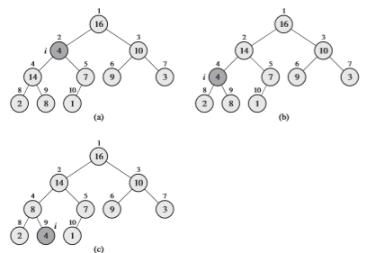
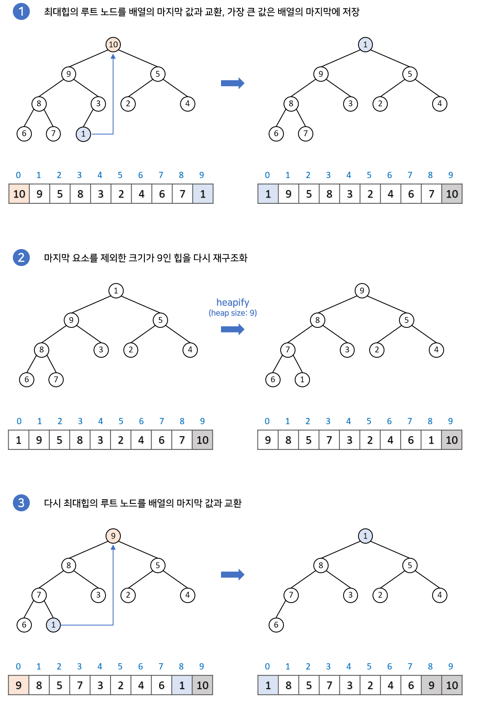
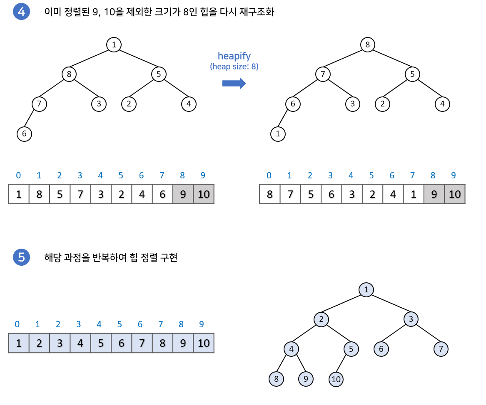
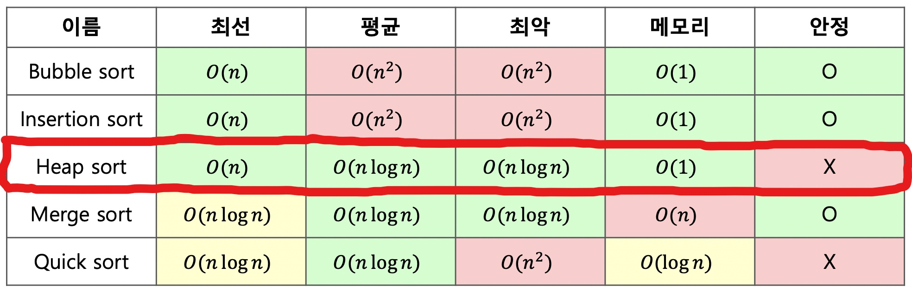

# Heap Sort
1st Writter : pdhyeong
2nd Writter : NightRabbits

## 힙 정렬(Heap Sort) 이란?
~~~
 *  힙 트리 구조를 이용한 정렬 알고리즘 방법(완전 이진 트리)
 *  병합 정렬과 퀵 정렬 만큼 빠른 정렬 알고리즘이다.
 *  최소 값과 최대값을 쉽게 추출할 수 있는 알고리즘
~~~

#### 힙 정렬 이해 하기!
~~~
힙정렬을 이해하기전에 가장 먼저 힙(Heap)이 무엇인지 알아야 한다.

그 외에도 이진트리(Binary Tree)도 알고 있을 필요가 있다.

* 트리: 나무처럼 가지를 뻗어나가는 모양처럼 데이터가 서로 연결되 있는 비선형 자료구조

* 이진 트리 : 모든 노드의 자식 노드가 2개 이하인 트리구조

힙은 '이진트리'이되 '완전 이진 트리'이다. 그리고 모든 노드에 저장된 값은 자식 노드에 저장된 값보다 크거나 같아야 함.

힙에는 최대 힙과 최소 힙이 존재하는데 최대 힙은 '부모 노드'가 '자식 노드'보드 큰 힙이라고 할 수 있다. 즉 더 큰 값이 '부모 노드'가 된다.

힙정렬을 하기 위해서는 정해진 데이터들을 힙 구조를 가지게 만들어야 한다.

힙생성(heapify) 알고리즘을 사용하여 최대 힙으로 배열을 구성 하고 그 후 힙 정렬을 수행하여 오름차순으로 표현 할 것이다.
~~~

#### 힙 구조는 완전 이진 트리 구조를 갖는다고 연결리스트로 표현한다고 생각할지 모르지만 '힙'은 배열 기반으로 구현해야 한다.
	 연결리스트 기반으로 힙을 구현하면, 새로운 노드를 힙의 '마지막 위치'에 추가하는 것이 쉽지 않기 때문이다.
<br><br>
### heapify 예시
최대 힙 구조를 만드는 heapify<br>

<br><br>

### 힙 정렬의 순서
먼저 힙 구조를 만든 후에 시행한다.<br>


> *  완전 이진트리를 이루는 힙 구조를 배열 기반으로 표현 한 이미지 이다.<br>
> *  부모노드를 표현하는 식과 자식 노드들을 표현하는 식



<br>

## 힙 정렬의 시간복잡도(Time Complexity)

* 힙 정렬은 평균과 최악에서의 시간 복잡도가 O(nlog n)인 강력한 정렬 알고리즘이다.
* 힙 정렬이 최대 힙 구성하는 과정에서 분할 정복이 사용되어서 분할 정복 이라고 하는 사람들도 있지만 분할정복으로 보지 않는 견해도 많다.


## Ex Code
```C
#include <stdio.h>

void firstheapify(int heap[], int num)// 힙 생성 알고리즘 
{
	for (int i = 1; i < num; i++)
	{ // 트리 구조를 최대 힙 구조로 변환
		int count = i; // 1부터 지정하는 이유는 자식노드는 1부터 있기때문에
		do {
		// count가 0이 아닐때 까지 자 크면 
			int root = (count - 1) / 2;
			if (heap[root] < heap[count])
			{
				int temp = heap[root];
				heap[root] = heap[count];
				heap[count] = temp;
			}
			count = root; // 자식의 부모로 이동
		} while (count != 0);
	}
}
void heapSort(int heap[], int num)// 힙 크기를 줄이면서 반복적으로 힙을 구성 하여 정렬하는 함수
{
	for (int i = num - 1; i >= 0; i--)
	{ // 반복적으로 힙구조를 구성하여 정렬 한다.
		int temp = heap[0];
		heap[0] = heap[i];
		heap[i] = temp;// 가장 큰 값 뒤로 보내기
		int root = 0;
		int count = 1;
		do {
			count = 2 * root + 1; //count 는 자식
			// 자식 중 더 큰 값을 찾은 다음
			if (heap[count] < heap[count + 1] && count < i - 1) // 자식끼리 비교해 범위를 벗어나지 않게 큰 자식 count에 담기
			{
				count++; 
			}
			// root보다 자식 노드 가 더 크면 swap
			if (heap[root] < heap[count] && count < i)
			{
				int temp = heap[root];
				heap[root] = heap[count];
				heap[count] = temp;
			}
			root = count;  // count값을 root로 넣어서 계속해서 재귀적으로 실행
		} while (count < i);
	}
}
void arrprint(int heap[],int num)
{ 
//정렬된 배열을 출력하는 함수
	for (int i = 0; i < num; i++)
	{
		printf("%d ", heap[i]);
	}
}
int main(void)
{
	int num = 9;
	int heaparr[9] = { 4,6,5,8,3,10,9,1,7 };

	firstheapify(heaparr, num);
	heapSort(heaparr, num);
	arrprint(heaparr, num);
	return 0;

}
```
<br>

### 코드 실행시 출력결과


<br><br>
사진 출처 : https://velog.io/@emplam27/%EC%95%8C%EA%B3%A0%EB%A6%AC%EC%A6%98-%EA%B7%B8%EB%A6%BC%EC%9C%BC%EB%A1%9C-%EC%95%8C%EC%95%84%EB%B3%B4%EB%8A%94-%ED%9E%99%EC%A0%95%EB%A0%ACHeap-Sort,
https://d2.naver.com/helloworld/0315536

## Heap Sort Java Code
```java
private void solve() {                                    
    int[] array = { 230, 10, 60, 550, 40, 220, 20 };
 
    heapSort(array);
 
    for (int v : array) {
        System.out.println(v);
    }
}
 
public static void heapify(int array[], int n, int i) {  // 2nd heapify
    int p = i;
    int l = i * 2 + 1;
    int r = i * 2 + 2;
    
    //왼쪽 자식노드
    if (l < n && array[p] < array[l]) {
        p = l;
    }
    
    //오른쪽 자식노드
    if (r < n && array[p] < array[r]) {
        p = r;
    }
    
    //부모노드 < 자식노드
    if (i != p) {
        swap(array, p, i);
        heapify(array, n, p);
    }
}
 
public static void heapSort(int[] array) {   // 1st heapify
    int n = array.length;
 
    // max heap 초기화
    for (int i = n / 2 - 1; i >= 0; i--) {
        heapify(array, n, i);
    }
 
    // extract 연산 
    for (int i = n - 1; i > 0; i--) {
        swap(array, 0, i);
        heapify(array, i, 0);
    }
}
 
public static void swap(int[] array, int a, int b) {
    int temp = array[a];
    array[a] = array[b];
    array[b] = temp;
}
//출처 : https://gyoogle.dev/blog/algorithm/Heap%20Sort.html
```
1. 일반 배열을 힙으로 구성하는 역할이다. 자식 노드로부터 부모 노드를 비교한다.<br>
   n/2-1부터 0까지 인덱스가 도는 이유는 부모 노드의 인덱스를 기준으로 왼쪽 자식노드(i2+1), 오른쪽 자식 노드(i2+2)이기 때문.<br>
   
2. 요소가 하나 제거된 이후에 다시 최대 힙을 구성하기 위한 역할이다.<br>
   루트를 기준으로 진행되며, 다시 최대 힙을 구성할 때 까지 부모 노드와 자식 노드를 swap하며 재귀가 진행됨.
   
   ## Heap Sort의 장점과 단점
<장점>
~~~
- 항상 O(NlogN)의 시간 복잡도를 가지므로 시간 복잡도가 O(NlogN)인 정렬 방법 중, 가장 효율적이다. 
- 정렬하고자 하는 배열 안에서 교환이 이루어지는 방식이므로, 다른 메모리 공간을 필요로 하지 않는다.(제자리 정렬)
~~~

<단점>
~~~
- 이상적인 경우에 퀵정렬과 비교해서 똑같이 O(NlogN)이 나오나, 실제 시간을 측정해 보면 퀵 정렬 보다 느리다.
- 안정성을 보장받지 못한다.
- 불안정 정렬(Unstable Sort)이다.
~~~

   
