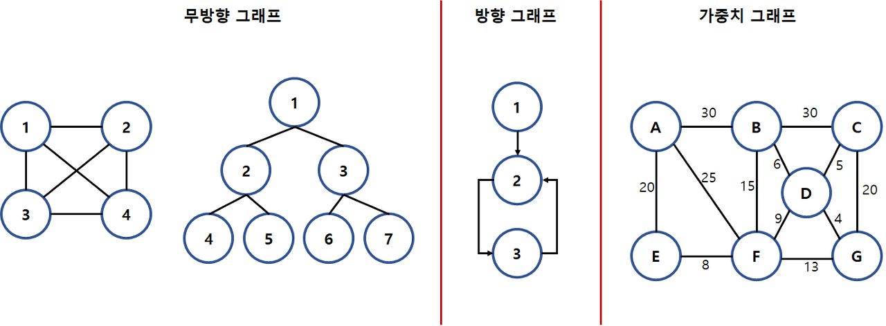

## 그래프란

  DFS는 그래프 탐색의 방법중 하나로 이 개념을 알기전에 그래프가 무엇인지 알아야한다.
  그래프란 노드와 노드를 간선으로 이어진 하나의 자료구조이다.
  
  

보는 것과 같이 노드와 노드를 간선으로 연결한 자료구조 이다. 트리도 이 그래프의 일종이다.

## 깊이 우선 탐색 DFS(Depth First Search) 란
~~~
+ DFS(Depth First Search)란 그래프를 탐색하는 방법중 하나로 루트 노드 또는 혹은 임의노드에서 시작해서 다음 노드로 넘어가기전에 해당 노드를 탐색하는 방법이다.
+ 자세하게 설명하면 어떠한 노드 V1에서 인접해 있는 노드 중 아직 탐색하지 않은 꼭짓점 V2를 방문하고,
V2에 인접해 있는 노드 중 아직 탐색하지 않는 노드 V3을 방문하는 것을 반복한다고 보면 된다. 
즉 Vn에 인접한 모든 노드를 방문한 경우 이전에 마지막으로 방문한 노드 Vn-1로 돌아가서 인접해 있는 노드중 방문하지 않는 노드를 다시 방문하는 과정을 반복하는데 
이때 방문하지 않은 노드를 방문하기 위해 이전의 노드에 방문하는 과정을 백 트래킹(Back traking) 이라고한다.
~~~
## DFS의 표현방법
인접행렬의 표현:

*인접행렬의 시간복잡도

인접리스트의 표현:

*인접리스트의 시간복잡도

## DFS의 특징

사진 출처 : https://pangtrue.tistory.com/147
