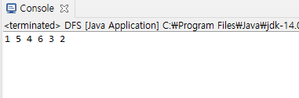
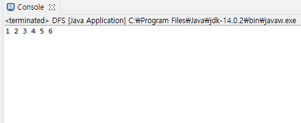
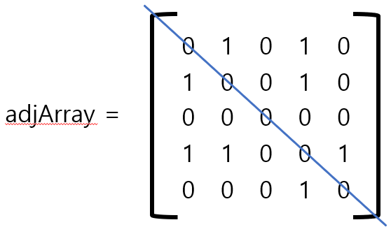
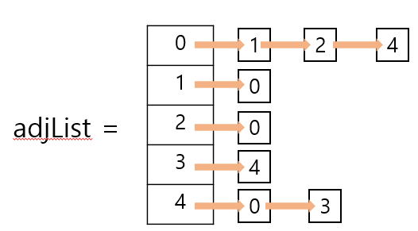

## 그래프란

  DFS는 그래프 탐색의 방법중 하나로 이 개념을 알기전에 그래프가 무엇인지 알아야한다.
  그래프란 노드와 노드를 간선으로 이어진 하나의 자료구조이다.
  
  

보는 것과 같이 노드와 노드를 간선으로 연결한 자료구조 이다. 트리도 이 그래프의 일종이다.

## 깊이 우선 탐색 DFS(Depth First Search) 란
~~~
+ DFS(Depth First Search)란 그래프를 탐색하는 방법중 하나로 루트 노드 또는 혹은 임의노드에서 시작해서 다음 노드로 넘어가기전에 해당 노드를 탐색하는 방법이다.

+ 자세하게 설명하면 어떠한 노드 V1에서 인접해 있는 노드 중 아직 탐색하지 않은 꼭짓점 V2를 방문하고,

+ V2에 인접해 있는 노드 중 아직 탐색하지 않는 노드 V3을 방문하는 것을 반복한다고 보면 된다. 

+ 즉 Vn에 인접한 모든 노드를 방문한 경우 이전에 마지막으로 방문한 노드 Vn-1로 돌아가서 인접해 있는 노드중 방문하지 않는 노드를 다시 방문하는 과정을 반복하는데 

+ 이때 방문하지 않은 노드를 방문하기 위해 이전의 노드에 방문하는 과정을 백 트래킹(Back traking) 이라고한다.

+ 모든 노드를 탐색하기 위해 사용된다.

+ DFS는 스택과 재귀함수를 이용해 표현할 수있다.

~~~
## DFS 스택에 관한 GIF

이때 정점 5를 들렸다가 4로 되돌아 가는 과정을 백 트래킹이라고 한다.

## DFS Java Code
~~~ java
import java.util.LinkedList;
import java.util.Iterator;
import java.util.Stack;
import java.util.NoSuchElementException;

class Graph {
	class Node {
		int data;
		LinkedList<Node> adjacent;
		boolean marked;
		Node (int data) {
			this.data = data;
			this.marked = false;
			adjacent = new LinkedList<Node>();
			
		}
	}
	Node[] nodes;
	Graph(int size) {
		nodes = new Node[size];
		for(int i = 0 ; i< size; i++) {
			nodes[i] = new Node(i);
		}
	}
	void addEdge(int i1,int i2) {
		Node n1 = nodes[i1];
		Node n2 = nodes[i2];
		if(!n1.adjacent.contains(n2)) {
			n1.adjacent.add(n2);
		}
		if(!n2.adjacent.contains(n1)) {
			n2.adjacent.add(n1);
		}
	}
	void dfs() {
		dfs(0);
	}
	void dfs(int index) {
		Node root = nodes[index];
		Stack<Node> stack = new Stack<Node>();
		stack.push(root);
		root.marked = true;
		while(!stack.isEmpty()) {
			Node r = stack.pop();
			for(Node n : r.adjacent) {
				if(n.marked == false) {
					n.marked = true;
					stack.push(n);
				}
			}
			visit(r);
		}
		
	}
	void dfsR(Node r) {
		if(r==null) return;
		visit(r);
		for(Node n : r.adjacent) {
			if(n.marked == false) {
				dfsR(n);
			}
		}
	}
	void dfsR(int index) {
		Node r = nodes[index];
		dfsR(r);
	}
	void visit(Node n) {
		System.out.print(n.data + " ");
	}
	void dfsR() {
		dfsR(0);
	}
}

public class DFS {

	public static void main(String[] args) {
		Graph g = new Graph(9);
		g.addEdge(1, 2);
		g.addEdge(1, 5);
		g.addEdge(2, 3);
		g.addEdge(2, 5);
		g.addEdge(3, 4);
		g.addEdge(4, 5);
		g.addEdge(4, 6);
		//g.dfs(1); 스택을 사용한 dfs
		g.dfsR(1); // 재귀적 표현을 사용한 dfs
	}
}

~~~
## Output

스택 사용  

재귀 사용  

## DFS의 표현방법
인접행렬의 표현: 

 
  인접행렬의 시간복잡도 와 공간복잡도 장단점 

    장점 : 비교적 리스트보다 구현이 간단하고 연결을 확인하는 시간복잡도가 O(1) 이다.
    
    단점 : 노드가 많고 간선이 적을때 비효율적이고 시간복잡도를 O(n^2) 메모리를 차지.
인접리스트의 표현: 

 
  인접리스트의 시간복잡도 와 공간복잡도 장단점 

    장점 : 1. 최악의 경우 시간복잡도가 O(n)이지만 대부분 인접행렬보다 빠르다.
           2. 시간복잡도가 최악을 제외하면 O(E)이므로 인접행렬의 시간복잡도인 O(n^2)보다 효율적이다.
    
    단점 : 맞는 노드를 순회 해야하므로 연결을 확인 하는 시간 복잡도가 O(n)이다.
    
## DFS의 특징
1. 미로를 한 방향으로 갈 수 있을때 까지 탐색하는 것과 비슷함. 막히면 뒤로 돌아와서 다른 방향 탐색하는 것
2. 모든 노드를 방문하고자 할 때 사용
3. DFS가 BFS보다 비교적 간단하다.
4. 대신 BFS보다 느리다.

## 장점과 단점
  장점
  
    * 단지 현 경로상의 노드들만을 기억하면 되므로 저장공간의 수요가 비교적 적다.
    
    * 목표노드가 깊은 단계에 있을 경우 해를 빨리 구할 수 있다.
    
  단점
    
    * 해가 없는 경로에 깊이 빠질 가능성이 있다. 
    
        따라서 실제의 경우 미리 지정한 임의의 깊이까지만 탐색하고 목표노드를 발견하지 못하면 다음의 경로르 따라 탐색하는 방법이 유용
        
    * 얻어진 해가 최단 경로가 된다는 보장이 없다. 
    
        이는 목표에 이르는 경로가 다수인 문제에 대해 깊이우선탐색은 해에 다다르면 탐색을 끝내버리므로, 이때 얻어진 해는 최적의 해가 아닐수 있다. 
  

사진 , 내용 출처 : https://pangtrue.tistory.com/147,  
https://blog.hexabrain.net/268, 
https://nobilitycat.tistory.com/entry/%EA%B9%8A%EC%9D%B4-%EC%9A%B0%EC%84%A0-%ED%83%90%EC%83%89-DFS-%EC%9D%B8%EC%A0%91-%ED%96%89%EB%A0%AC-%EC%9D%B8%EC%A0%91-%EB%A6%AC%EC%8A%A4%ED%8A%B8
 https://yunyoung1819.tistory.com/86
 https://velog.io/@polynomeer/%EA%B9%8A%EC%9D%B4-%EC%9A%B0%EC%84%A0-%ED%83%90%EC%83%89DFS
 https://www.youtube.com/watch?v=_hxFgg7TLZQ&list=PLjSkJdbr_gFY8VgactUs6_Jc9Ke8cPzZP&index=6
