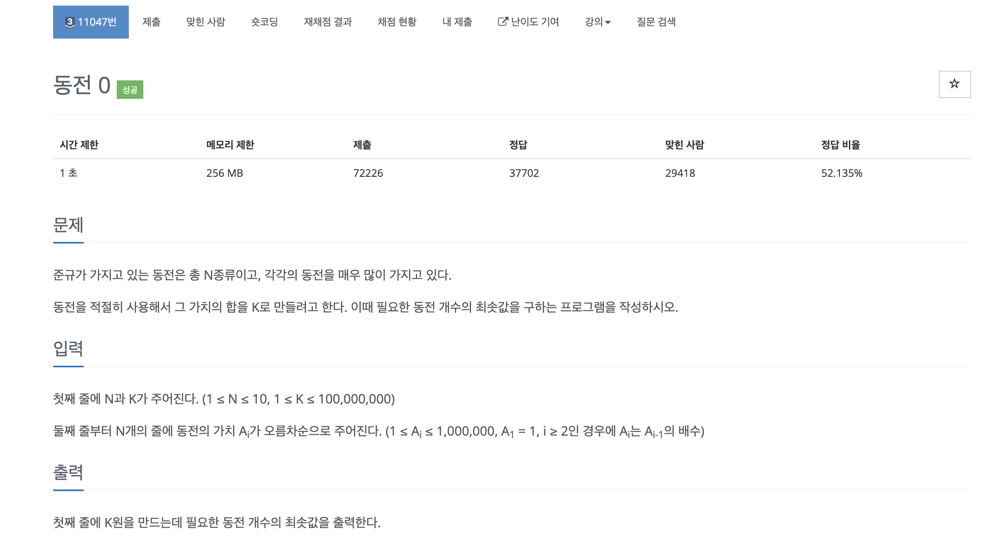

## 11047 코인0

 

## 처음 내가 생각한 풀이과정 
  - 동전을 넣을 배열을 생성해 데이터를 넣고 큰 단위에 화폐부터 그 아래 단위의 화폐와 계산하려고했다.
  - 솔직히 문제는 실버 3이라고 달아놨지만 내가 푼 실버 문제중에 제일 고민을 적게한거 같다.

 

## 중간에 막혔던점
  - 처음엔 4650원 처럼 천원 오백원 백원 오십원 단위로 나눠지는 것만 생각하면서 풀었디.
  - 생각해보니 4090 원처럼 바로 아래 단위를 안거치고 최소 단위로 가는 법을 생각을 못해서 막혔었다.
  - 그래서 잔돈 개념을 넣어서 잔돈을 배열 데이터와 비교하여 맞는 단위가 나올때 까지 continue를 하는 방법으로 해결하였다.

 

## 해당 코드

~~~C
#include <stdio.h>

int main(int argc, const char * argv[]) {
    int arr[100],num1,num2,j,i;
    int count = 0,coin = 0;
    scanf("%d %d",&num1,&num2);
    for(i = 0;i<num1;i++)
    {
        scanf("%d",&arr[i]); // 동전들 입력
    }
    for(j = i-1 ;j>=0;j--)
    {
        count = 0;
        if(num2 < arr[j])
            continue; // num2가 나눌수있는 수가 나올수있을때 까지 동전단위 찾기
        else {
            count += (num2/arr[j]); // 맞는 동전을 찾으면 나눈후 count에 더하기
            num2 = num2 - (count*arr[j]); //잔액 구하기
            coin += count; // 동전 갯수만큼 coin 변수에 더해주기
        }
    }
    printf("%d\n",coin);
    return 0;
}
~~~
