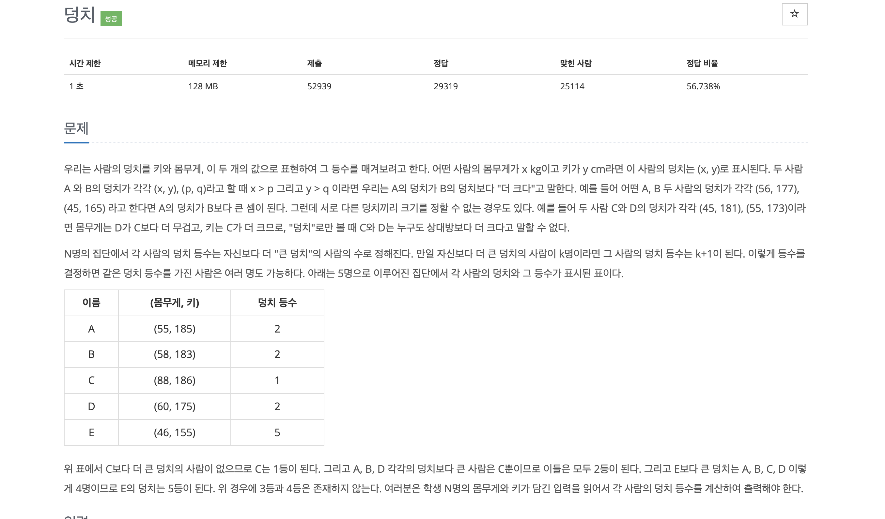

# 백준 7568 덩치

 
## 처음 나의 풀이과정 생각
 - 원래는 처음보자마자 이산수학의 전단사함수(bijective function)의 의미로 접근했다. 
 - 전단사 함수 개념으로 접근하니 문제해결의 방도가 보이지 않았지만 고민을 해보니 배열을 생성 한후 
 - 모든 경우를 고려해서 비교해보면 된다는 생각이 들었다. 
 - 그래서 모든 경우에 각각의 점수를 부여해서 점수에 따라 등수를 매기는 방법을 선택했다. 

## 틀렸던 코드 
~~~C
#include <stdio.h>

int main() {
  int num,i;
  int arr[50] = {0,}; // 점수 부여한 배열
  int war[50] ={0,}; // 몸무게 배열
  int har[50] = {0,}; // 키 배열
  int rank[50] = {0,}; // 순위 배열

  scanf("%d", &num);
  //입력
  for(i=0;i<num;i++){
    scanf("%d %d",&war[i],&har[i]);
  }
  
  for(int j=0;j<num;j++){
    for(int k=0;k<num;k++){
      if(war[j] > war[k] && har[j] > har[k]){
        arr[j] += 1; //덩치가 크면 점수 부여
      }
      else {
        arr[j] -= 1; // 덩치가 작거나 알수없다면 점수 감소
      }
    }
  }
  for(int i=0;i<num;i++){ // 점수에 따라서 순위를 매기는 알고리즘
    for(int j=0;j<num;j++){
      if(arr[j] > arr[i]){ // 비교해서 순위가 높다면 0으로 초기화 되어있는 배열에 점수를 부여해서 순위 up(버블정렬과 비슷한 개념)
        rank[i]++;
      }
    }
      printf("%d ",rank[i]+1);
  }
  return 0;
}
  

~~~

## 중간에 발견한 나의 오류점
  - 모든 경우를 비교하면 된다고 말로만 하면 쉽지만 어떻게 보면 if문이 길어지는 느낌이 끊임없이 들었다. 
  - 점수에 따라서 덩치가 달라진다고 생각했지만 문제 자체는 그냥 비교가 불가능하면 다 같은 등수로 치는것을 나중에 이해했다. 
  - 여기서 조금 많이 해맸던거 같아 솔직히 중간에 점수 부여하는 조건을 바꿔서 넣어보기도 했는데 입력과 출력이 맞게 나오는데도  
  - 틀렸다고 나와서 코드를 여러번 수정했다. 그러던 중 수열에 순위 매기는 코드를 구글링으로 보는 와중 해당 코드와 나의 코드의  
  - 비슷한 한 점이 발견됐고 그거를 응용해서 풀었다.
  
## 해당코드

~~~C
#include <stdio.h>

int main() {
  int num,i;
  //   int arr[50] = {0,};  점수 배열 삭제 
  int war[50] ={0,};
  int har[50] = {0,};
  int rank[50] = {0,};

  scanf("%d", &num);
  for(i=0;i<num;i++){
    scanf("%d %d",&war[i],&har[i]);
  }
  for(int j = 0;j<num;j++){
    for(int k = 0;k<num;k++){
      if(war[j] < war[k] && har[j] < har[k]) // 점수를 부여하는거보다 덩치가 작을수록 순위를 올려서 간단하게 출력하였다.
      rank[j] += 1;
    }
    printf("%d ",rank[j]+1);
  }
  return 0;
}
~~~
