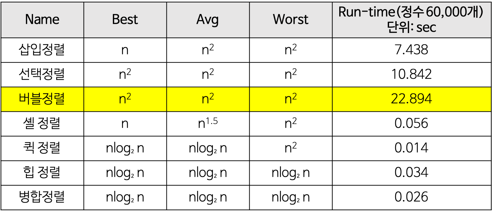

# BSI Sort
1st Writter : NightRabbit  

## 1-1. Bubble Sort 의 정의
~~~
- 서로 인접한 두 원소의 대소를 비교하고, 조건에 맞지 않다면 자리를 교환하며 정렬하는 알고리즘 이다.
- 이름의 유래는 정렬 과정에서 원소의 이동이 거품이 수면으로 올라오는 듯한 모습을 보이기 때문에 지어졌다고 한다.
~~~

## 1-2. Bubble Sort Java Code
```java
void bubbleSort(int[] arr) {
    int temp = 0;
	for(int i = 0; i < arr.length; i++) {       // 1. 인덱스 처음부터 끝까지 비교하기 위해 반복문 선언
		for(int j= 1 ; j < arr.length-i; j++) { // 2. 비교할 j 변수로 arr[j-1]번째와 arr[j]번째를 비교 반복문
			if(arr[j-1] > arr[j]) {             // 3. 앞 뒤 데이터를 비교하여 앞에 데이터가 더 크면 swap
                // swap(arr[j-1], arr[j])
				temp = arr[j-1];
				arr[j-1] = arr[j];
				arr[j] = temp;
			}
		}
	}
	System.out.println(Arrays.toString(arr)); // 4. 배열 출력
}
//출처 : https://gyoogle.dev/blog/algorithm/Bubble%20Sort.html
```

1. 제외될 원소의 갯수를 의미한다. 1회전이 끝난 후 배열의 마지막 위치에는 가장 큰<br>
   원소가 위치하기 때문에 하나씩 증가시켜준다.<br>
   
2. 원소를 비교할 index를 뽑는 반복문이다. j는 현재 원소를 가리키고, j-1은 이전 원소를<br>
   가리키게 되므로, j는 1부터 시작하게 된다.<br>
   
3. 현재 가리키고 있는 두 원소의 대소를 비교한다. 해당 코드는 오름차순 정렬이므로 현재 원소보다<br>
   이전 원소가 더 크다면 이전 원소가 뒤로 가야하므로 서로 자리를 교환해준다.   

## 1-3.  Bubble Sort 의 시간 복잡도 와 공간 복잡도
시간 복잡도를 계산하려면 우선 비교 횟수와 교환 횟수를 구해야 한다.<br>
Bubble Sort의 비교 횟수는 최상, 평균, 최악일때도 모두 일정하므로 다음과 같다.
~~~
n-1, n-2, … , 2, 1 번 = n(n-1)/2
~~~
교환 횟수는 입력 자료가 역순으로 정렬되어 있는 최악의 경우, 한 번 교환하기 위하여 3번의 이동이 필요 하므로 다음과 같다.
~~~
(비교 횟수 * 3) 번 = 3n(n-1)/2
~~~
하지만 입력 자료가 이미 정렬되어 있는 최상의 경우에는 자료의 이동이 발생하지 않는다.<br>
그러므로 시간복잡도는 다음과 같다
~~~
T(n) = O(n^2)
~~~
공간 복잡도는 주어진 배열 안에서 교환을 통해 정렬이 수행이 되므로 다음과 같다.
~~~
S(n) = O(n)
~~~

## 1-4. Bubble Sort의 장단점
<장점>
~~~
- 구현이 매우 간단하고, 소스코드가 직관적이다.
- 정렬하고자 하는 배열 안에서 교환하는 방식이므로, 다른 메모리 공간을 필요로 하지 않는다.(제자리 정렬)
- 안정 정렬(Stable Sort)이다.
~~~
<단점>
~~~
- 시간 복잡도가 최악, 최선, 평균 모두 O(n^2)으로 굉장히 비효율적이다.
- 정렬 되어있지 않은 원소가 정렬이 되었을 때의 자리로 가기 위해서 교환 연산이 많이 일어나게 된다.
~~~
## 1-5. Bubble Sort의 GIF

* 사진 출처: https://gyoogle.dev/blog/algorithm/Bubble%20Sort.html
## 2-1. Selection Sort의 정의
~~~
- Selection Sort는 Bubble Sort와 유사한 알고리즘으로, 해당 순서에 원소를 넣을 위치는 이미 정해져 있고
  어떤 원소를 넣을지 선택하는 알고리즘 이다.
- Selection Sort는 배열에서 해당 자리를 선택하고 그 자리에 오는 값을 찾는 것 이다.
~~~

## 2-2. Selection Sort Java Code
```java
void selectionSort(int[] arr) {
    int indexMin, temp;
    for (int i = 0; i < arr.length-1; i++) {        // 1. 인덱스르 비교하기 위한 반복문
        indexMin = i; // 가장 작은 인덱스 값을 담은 변수
        for (int j = i + 1; j < arr.length; j++) {  // 2. arr[indexMin] 에 비교할 변수 j를 잡고 arr[j] 
            if (arr[j] < arr[indexMin]) {           // 3. 만약에 비교하는 데이터중 제일 작은 데이터가 나오면
                indexMin = j; // 그 데이터를 가장 작은 인덱스의 데이터로 할당
            }
        }
        // 4. swap(arr[indexMin], arr[i])
        temp = arr[indexMin]; // 가장 작은 데이터와 i번째 데이터
        arr[indexMin] = arr[i];
        arr[i] = temp;
  }
  System.out.println(Arrays.toString(arr)); // 배열 출력
}
//출처 : https://gyoogle.dev/blog/algorithm/Selection%20Sort.html
```
1. 우선, 위치(index)룰 선택해준다.

2. i+1번째 원소부터 선택한 위치(index)의 값과 비교를 시작한다.

3. 오름차순이므로 현재 선택한 자리에 있는 값보다 순회하고 있는 값이 작다면, 위치(index)를 갱신해준다.

4. '2'번 반복문이 끝난 뒤에는 indexMin에 '1'번에서 선택한 위치(index)에 들어가야 하는 값의 위치(index)<br>
   를 갖고 있으므로 서로 교환 해준다.
   
## 2-3.  Selection Sort 의 시간 복잡도 와 공간 복잡도
시간 복잡도를 계산하려면 우선 비교 횟수와 교환 횟수를 구해야 한다.<br>
데이터의 개수가 n개라고 했을 때, 비교 횟수는 다음과 같다
~~~
두 개의 for 루프의 실행 횟수
외부 루프 : (n-1)번
내부 루프(최솟값 찾기) : n-1, n-2, ..., 2, 1 번
~~~

데이터의 개수가 n개라고 했을 때, 교환 횟수는 다음과 같다.
~~~
- 외부 루프의 실행 횟수와 동일. 즉 상수 시간 작업
- 한번 교환하기 위해 3번의 이동이 필요하므로 3(n-1)번
~~~
따라서 시간 복잡도는 다음과 같다.
~~~
T(n) = (n-1) + (n-2) + … + 2 + 1 = n(n-1)/2 = O(n^2)
~~~

공간 복잡도는 주어진 배열 안에서 교환을 통해 정렬이 수행이 되므로 다음과 같다.
~~~
S(n) = O(n)
~~~

## 2-4. Selection Sort의 장단점
<장점>
~~~
- 알고리즘이 단순하다
- 정렬을 위한 비교 횟수는 많지만, Bubble Sort에 비해 실제로 교환하는 횟수는 적기 때문에
  많은 교환이 일어나야 하는 자료상테에서 비교적 효율적이다.
- 정렬하고자 하는 배열 안에서 교환하는 방식이므로, 다른 메모리 공간을 필요로 하지 않는다.(제자리 정렬)
~~~

<단점>
~~~
- 시간 복잡도가 O(n^2)로 비효율적이다.
- 불안정 정렬(Unstable Sort)이다.
~~~
### 2-5 Selection Sort의 GIF

* 사진 출처 :https://gyoogle.dev/blog/algorithm/Selection%20Sort.html
## 3-1. Insertion Sort의 정의
~~~
- Insertion Sort는 2번째 원소부터 시작하여 그 앞의 원소들과 비교하여 삽입 할 위치를 지정한 후,
  원소를 뒤로 옮기고 지정된 자리에 자료를 삽입 하여 정렬하는 알고리즘이다.
- 손 안의 카드를 정렬하는 방법과 유사한 알고리즘이다.
~~~

## 3-2. Insertion Sort Java code
```java
void insertionSort(int[] arr)
{
   for(int index = 1 ; index < arr.length ; index++){ // 1. 비교하기 위한 반복문
      int temp = arr[index]; // temp 변수에 바꿀값
      int prev = index - 1; // prev에 바꾸기 전 인덱스 번호
      while( (prev >= 0) && (arr[prev] > temp) ) {    // 2. 범위를 벗어나지 않게 설정해주고 arr[prev]가 더클때 반복
         arr[prev+1] = arr[prev]; // 값을 뒤로 밀어버리고
         prev--; // 비교 인덱스를 앞으로 땡긴다.
      }
      arr[prev + 1] = temp;                           // 3. 반복문에서 나오면 작은 값을 prev 앞에 대입
   }
   System.out.println(Arrays.toString(arr)); //배열 
}
//출처 : https://gyoogle.dev/blog/algorithm/Insertion%20Sort.html
```
1. 첫 번째 원소 앞(왼쪽)에는 어떤 원소도 가지고 있지 않기 때문에, 두 번째 위치(index)부터 탐색을 시작한다.
   temp에 임시로 해당 위치(index) 값을 저장하고, prev에는 해당 위치(index)의 이전 위치(index)를 저장한다.
   
2. 이전 위치(index)를 가리키는 prev가 음수가 되지않고, 이전 위치(index)의 값이 '1'번에서 선택한 값보다 크다면,
   서로 값을 교환해주고 prev를 더 이전위치(index)를 가리키도록 한다.
   
3. '2'번에서 반복문이 끝나고 난 뒤, prev에는 현재 temp 값보다 작은 값들 중 제일 큰 값의 위치(index)를 가리키게 된다.
   따라서 (prev+1)에 temp 값을 삽입해준다.
      
## 3-3.  Insertion Sort 의 시간 복잡도 와 공간 복잡도
시간 복잡도를 계산하려면 우선 비교 횟수와 교환 횟수를 구해야 한다.<br>
Insertion Sort는 최선의 경우와 최악의 경우를 나눠서 살펴보아야 한다.

<최선의 경우><br>
최선의 경우일 때 비교 횟수는 다음과 같다.
~~~
- 원소의 이동이 없이 1번의 비교만 이루어진다.
- 외부 루프 : (n-1)번
~~~

최선의 경우일 때에는 교환이 이루어지지 않기 때문에 교환 횟수는 없다.<br>
그러므로 최선의 경우에서의 시간 복잡도는 다음과 같다.

~~~
Best T(n) = O(n)
~~~

<최악의 경우>(입력 자료가 역순일 경우)<br>
최악의 경우일 때 비교 횟수는 다음과 같다.
~~~
- 외부 루프 안의 각 반복마다 i번의 비교 수행
- (n-1) + (n-2) + … + 2 + 1 = n(n-1)/2
~~~

최악의 경우에는 교환이 이루어지므로 교환 횟수는 다음과 같다.
~~~
- 외부 루프의 각 단계마다 (i+2)번의 이동 발생
- n(n-1)/2 + 2(n-1) = (n^2+3n-4)/2
~~~

최악의 경우에서의 시간 복잡도는 다음과 같다.
~~~
Worst T(n) = O(n^2)
~~~

공간 복잡도는 주어진 배열 안에서 교환을 통해 정렬이 수행이 되므로 다음과 같다.
~~~
S(n) = O(n)
~~~

## 3-4. Insertion Sort의 장단점
<장점>
~~~
- 대부분의 원소가 정렬이 되어있는 경우, 상당히 효율적일 수 있다.
- 정렬하고자 하는 배열 안에서 교환이 이루어지는 방식이므로, 다른 메모리 공간을 필요로 하지 않는다.(제자리 정렬)
- Selection Sort나 Bubble Sort과 같은 O(n^2) 알고리즘에 비교하여 상대적으로 빠르다.
- 안정 정렬(Stable Sort)이다.
~~~

<단점>
~~~
- 평균과 최악의 시간 복잡도가 O(n^2)으로 비효율적이다.
- Selection Sort나 Bubble Sort와 마찬가지로 배열의 길이가 길어질 수록 비효율적이다.
~~~
## 3-5. Insertion Sort의 GIF

* 사진 출처 :https://gyoogle.dev/blog/algorithm/Insertion%20Sort.html


## 시간복잡도 비교

- 정렬 알고리즘 마다 시간 복잡도를 비교한 사진
- 접근적 표기법으로 나타낸 것
- 삽입정렬과, 버블정렬은 안정정렬이다, 선택 정렬은 불안정정렬이다. <br>
사진 출처 : https://gmlwjd9405.github.io/2018/05/06/algorithm-bubble-sort.html


# improved && advanced BSI Sort

오늘은 이론적인  내용이 주를 이룰것이라고 생각되어 집니다.

# 양방향 버블 정렬

양방향 버블 정렬은 칵테일 , 셰이커 정렬이라고도 불리우는 정렬입니다!

기존의 버블정렬은 한방향 즉 우측번째의 인덱스를 비교하고 패스하는 식의 정렬방식으로 이루어져 있습니다. 

그러나 양방향 버블 정렬에선 인덱스를 비교한뒤 방향을 바꾸고 패스를 진행한뒤 비교가 이루어진다고 볼 수 있습니다.

그리하여 홀수번째 패스에서는 가장 작은요소를 맨 앞으로 패스 할수있고, 짝수번째 패스에서는 가장 큰 요소를 맨 뒤로 패스 시킬 수 있습니다.

기본적인 요소는 오름차순으로 정렬 하는 알고리즘 입니다. 그러나 코드의 방향성을 내림차순으로 변경 하려면 코드의 비교 연산자를 반대로 채용 하면 될것 같습니다.

또한 시간 복잡도는  기존의 버블정렬과 같습니다. 그러나 개선된 알고리즘인만큼 속도는 버블 정렬 보다는 조금더 빠르게 작동합니다.

# 이중 선택 정렬

이중 선택 정렬 방법이란 기존의 한번 루틴의 한번 최소값을 선택하는 선택 정렬 과는 달리 한번의 루틴으로 최소값과 최대값을 한번에 선택한뒤 정렬 하는 방법이 있습니다. 

이 방법을 통하면 반복 횟수가 반으로 줄어들어 시간이 줄어듭니다.

또한 기본 버블 정렬 보다 2배 정도 빠른 시간을 가지고 있습니다.

또한 시간 복잡도는 기존과 같습니다! 

# 이진 삽입 정렬

현재 타겟이 되는 숫자에 대해 이전 위치에 있는 인덱스들에 들어갈 위치를 이분 탐색을 통해 얻어 낸뒤 들어갈 위치를 비우기 위해 후방의 인덱스 들을 한칸씩 밀고 공간에 삽입 한뒤 다음 타겟을 같은 방법으로 반복합니다.

안정 정렬을 위해선 타겟이 되는 숫자 다음에가장 오른쪽위치로 위치하게 해야합니다. 

출처:

[https://velog.io/@swhan9404/버블정렬-칵테일정렬-빗질정렬](https://velog.io/@swhan9404/%EB%B2%84%EB%B8%94%EC%A0%95%EB%A0%AC-%EC%B9%B5%ED%85%8C%EC%9D%BC%EC%A0%95%EB%A0%AC-%EB%B9%97%EC%A7%88%EC%A0%95%EB%A0%AC)
[https://ko.wikipedia.org/wiki/선택_정렬#다양한_개선_방법](https://ko.wikipedia.org/wiki/%EC%84%A0%ED%83%9D_%EC%A0%95%EB%A0%AC#%EB%8B%A4%EC%96%91%ED%95%9C_%EA%B0%9C%EC%84%A0_%EB%B0%A9%EB%B2%95)

[https://st-lab.tistory.com/262](https://st-lab.tistory.com/262)

[https://library-of-k.tistory.com/24](https://library-of-k.tistory.com/24)

[https://www.geeksforgeeks.org/binary-insertion-sort/](https://www.geeksforgeeks.org/binary-insertion-sort/)
