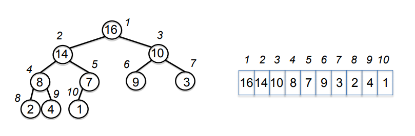

# Heap Sort
1st Writter : pdhyeong

## 힙 정렬(Heap Sort) 이란?
~~~
 * 힙 트리 구조를 이용한 정렬 알고리즘 방법(완전 이진 트리)
 * 병합 정렬과 퀵 정렬 만큼 빠른 정렬 알고리즘이다.
 * 최소 값과 최대값을 쉽게 추출할 수 있는 알고리즘
~~~

#### 힙 정렬 이해 하기!
~~~
힙정렬을 이해하기전에 가장 먼저 힙(Heap)이 무엇인지 알아야 한다.

그 외에도 이진트리(Binary Tree)도 알고 있을 필요가 있다.

* 트리: 나무처럼 가지를 뻗어나가는 모양처럼 데이터가 서로 연결되 있는 비선형 자료구조

* 이진 트리 : 모든 노드의 자식 노드가 2개 이하인 트리구조

힙은 '이진트리'이되 '완전 이진 트리'이다. 그리고 모든 노드에 저장된 값은 자식 노드에 저장된 값보다 크거나 같아야 함.

힙에는 최대 힙과 최소 힙이 존재하는데 최대 힙은 '부모 노드'가 '자식 노드'보드 큰 힙이라고 할 수 있다. 즉 더 큰 값이 '부모 노드'가 된다.

힙정렬을 하기 위해서는 정해진 데이터들을 힙 구조를 가지게 만들어야 한다.
~~~

#### 힙 구조는 완전 이진 트리 구조를 갖는다고 연결리스트로 표현한다고 생각할지 모르지만 '힙'은 배열 기반으로 구현해야 한다.
	 연결리스트 기반으로 힙을 구현하면, 새로운 노드를 힙의 '마지막 위치'에 추가하는 것이 쉽지 않기 때문이다





> 이 사진이 힙 구조를 표현한 것이다.


## 힙 정렬의 시간복잡도(Time Complexity)


## Ex Code
```C
#include <stdio.h>

void heapify(int heap[], int num)
{
// 힙 생성 알고리즘 
	for (int i = 1; i < num; i++)
	{ //힙을 구조화한 알고리즘
		int count = i;
		do {
			int root = (count - 1) / 2;
			if (heap[root] < heap[count])
			{
				int temp = heap[root];
				heap[root] = heap[count];
				heap[count] = temp;
			}
			count = root;
		} while (count != 0);
	}
}
void heapSort(int heap[], int num)
{
	for (int i = num - 1; i >= 0; i--)
	{
		int temp = heap[0];
		heap[0] = heap[i];
		heap[i] = temp;
		int root = 0;
		int count = 1;
		do {
			count = 2 * root + 1;
			if (heap[count] < heap[count + 1] && count < i - 1)
			{
				count++;
			}
			if (heap[root] < heap[count] && count < i)
			{
				int temp = heap[root];
				heap[root] = heap[count];
				heap[count] = temp;
			}
			root = count;
		} while (count < i);
	}
}
void arrprint(int heap[],int num)
{
	for (int i = 0; i < num; i++)
	{
		printf("%d ", heap[i]);
	}
}
int main(void)
{
	int num = 9;
	int heaparr[9] = { 4,6,5,8,3,10,9,1,7 };

	heapify(heaparr, num);
	heapSort(heaparr, num);
	arrprint(heaparr, num);
	return 0;

}
```

### 코드 실행시 출력결과

