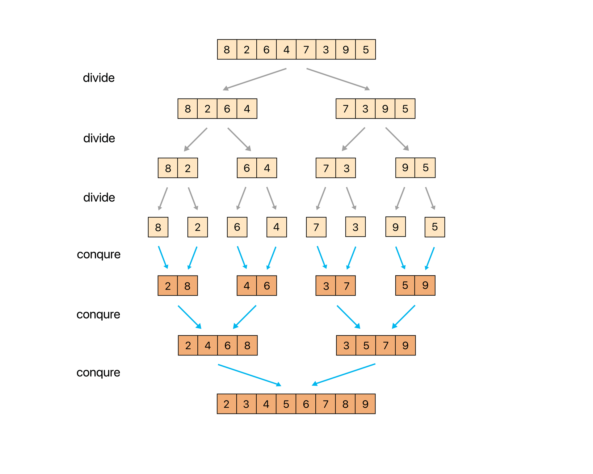
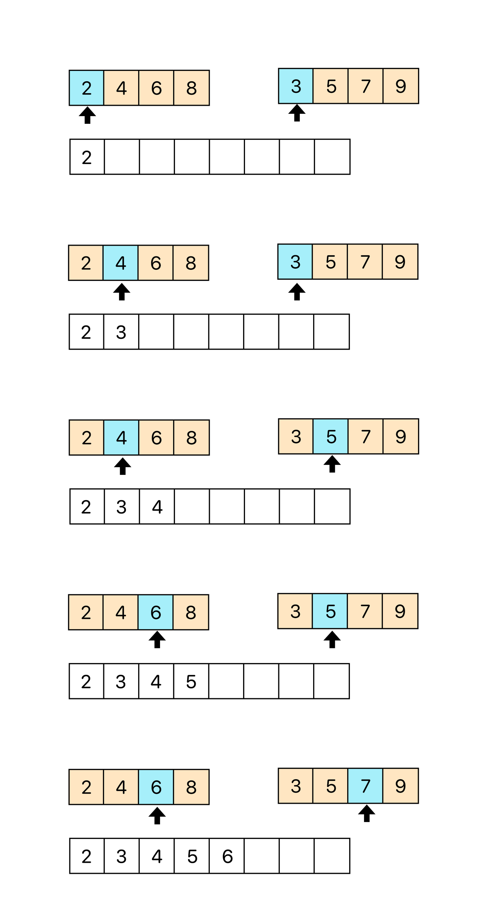
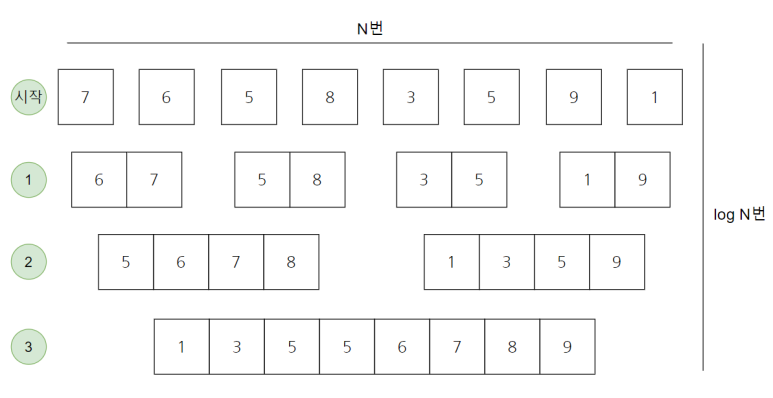

# Merge Sort (병합정렬)
>1st Writter : MallangMallang
~~~
배열의 모든 숫자를 계속 나눈 뒤 병합하는 분할정복 알고리즘
~~~
    
## 분할정복법
~~~
분할 : 해결하고자 하는 문제를 작은 크기의 동일한 문제들로 분할
정복 : 각각의 작은 문제를 순환적으로 해결
합병 : 작은 문제의 해를 합하여(merge) 원래 문제에 대한 해를 구함
~~~

 

## 시간복잡도

 |평균|최선|최악|
 |:---: | :---: | :---: |  
 | O(N logN) | O(N logN) | O(N logN) |

 

 

