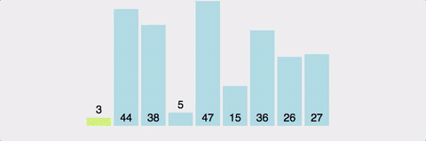

```java
import java.util.Arrays;

public class Quick_Sort {
    
    public static int partition(int[] arr, int left, int right) {

        int pivot = (left + right) / 2; //pivot값은 배열의 중간 지점

        // 작은 값은 pivot의 왼쪽, 큰 거는 오른쪽으로 이동
        while (left < right) {
            while (left <= right && arr[left] <= arr[pivot])
                left++;
            while (left <= right && arr[right] > arr[pivot])
                right--;

            if (left <= right) { //왼쪽 지점과 오른쪽 지점이 교차했는지 검사
                swap(arr, left, right)
                // 오른쪽 검사가 다 끝난 경우는 right=pivot
                // right는 arr[pivot]과 같은 값도 멈추기 때문
                if (right == pivot) {
                    // left 와 pivot을 swap 한 경우이므로
                    // 기준 점을 left로 수정
                    return left;
                }
            }
        }
        // left는 검사가 끝났는데, right는 안 끝난 경우
        // pivot의 기준점을 right로 바꾸기
        if (right != pivot) {
            swap(arr, right, pivot)
        }
        return right;

    }
    
    //값 정렬
    public static void quickSort(int[] arr, int left, int right) {

        if (left < right) {

            int pivot = partition(arr, left, right);
            // 기준의 왼쪽 배열들
            quickSort(arr, left, pivot - 1);
            // 기준의 오른쪽 값들
            quickSort(arr, pivot + 1, right);

        }
    }

    //스왑 함수
    public static void swap(int[] arr, int start, int end) {
        int temp = arr[start];
        arr[start] = arr[end];
        arr[end] = temp
    }

    // 출력
    public static void main(String[] args) {

        int[] arr = { 1, 3, 56, 8, 9, 21, 2, 42, 23, 11, 10 };
        quickSort(arr, 0, arr.length - 1);
        System.out.println(Arrays.toString(arr));

    }
}

```



Copyright (c) 2021 DaelimCollege_JumpStudy